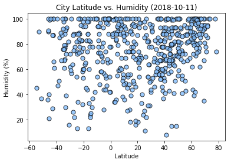
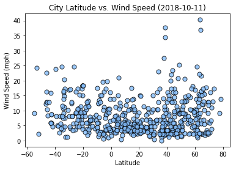

# Python API Practice
 
This report uses Python requests, APIs, and JSON traversals to track how weather changes as we approach the equator by specifically utilizing Python's Matplotlib library, Python's citypy library, the OpenWeatherMap API, and Jupyter Notebook to visualize the weather of 500+ cities across the world of varying distance from the equator. 

The change in weather in relation to the equator is displayed in a series of scatter plots depicting the following relationships: Temperature (F) vs. Latitude, Humidity (%) vs. Latitude, Cloudiness (%) vs. Latitude, Wind Speed (mph) vs. Latitude

## Weather Analysis Conclusions
 
### Latitude vs. Temperature

The data seems to confirm that the temperature is indeed higher as the cities' latitudes approach the equator (or 0 degrees latitude). Interestingly, it also appears that this sample captured a higher number of random cities in the northern than the southern hemisphere. 

### Latitude vs. Humidity

There does not appear to be any relationship between latitude and humidity, but it does seem that most cities in the sample had over 50% humidity on the date of capture. 

### Latitude vs. Cloudiness

There does not appear to be any relationship between latitude and cloudiness, but there is an interesting clustering pattern where there are a large number of cities that appear to have 0%, 80%, and 100% cloudiness.

### Latitude vs. Wind Speed

There does not appear to be any relationship between latitude and wind speed, but it does appear that most of the cities in this sample had winds less than 15mph on the date of capture.

Data Source: Data Boot Camp © 2018. All Rights Reserved.