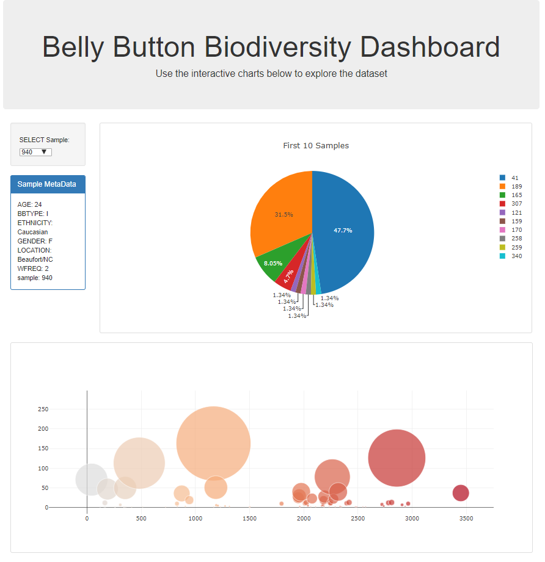

# Interactive-Visualizations-and-Dashboards

Below is a screenshot of the finished interactive dashboard of the [Belly Button Biodiversity DataSet](http://robdunnlab.com/projects/belly-button-biodiversity/) deployed to heroku:
* (to see it in action, click [here](https://belly-button-dashboard2.herokuapp.com/))

  
